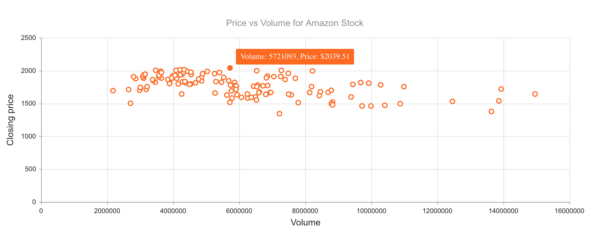

# Kendo UI ScatterChart for Vue

## Overview

A scatter chart uses dots to plot data points on a horizontal and vertical axis. Each axis represents a variable and the purpose of the scatter chart is to reveal if there is a relationship between the two variables. This demo shows a scatter chart representing the closing price and volume of Amazon stock.

## Example



## Getting Started

See the following tutorial for instructions on basic usage:

[How to Use a Vue Scatter or Bubble Chart UI Component in Your Web App](https://www.telerik.com/blogs/how-to-use-a-vue-scatter-or-bubble-chart-ui-component-in-your-web-app)

## Build Setup

``` bash
# install dependencies
npm install

# serve with hot reload at localhost:8080
npm run dev

# build for production with minification
npm run build
```

## Related Links

- [Kendo UI Pie Chart for Vue](https://github.com/albertaw/kendoui-piechart)
- [Kendo UI Donut Chart for Vue](https://github.com/albertaw/kendoui-donutchart)
- [Kendo UI Bubble Chart for Vue](https://github.com/albertaw/kendoui-bubblechart)
- [Kendo UI Bar Chart for Vue](https://github.com/albertaw/kendoui-barchart)
- [Kendo UI Line Chart for Vue](https://github.com/albertaw/kendoui-linechart)
- [Kendo UI StockChart for Vue](https://github.com/albertaw/kendoui-stockchart)
- [Kendo UI Sparkline for Vue](https://github.com/albertaw/kendoui-sparkline)


